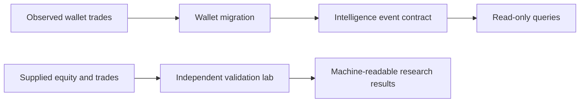

# Solana Sentinel

**Solana Agentic Trading Research Platform**

**PAPER ONLY. LIVE OFF. `canBroadcast=false`.**

Solana wallet monitoring and paper research with transaction evidence, durable PostgreSQL checkpoints, an internal alert inbox, token-risk analysis and simulated fills. Private production deployments default to monitor-only. Interpretation coverage and operating limits are documented with reproducible evidence.

This is intentionally an engineering/research system, not a trading promise. It demonstrates event-driven ingestion, domain rules around untrusted external data, bounded model assistance, and safety controls that keep the model below deterministic policy and risk decisions.

> Not investment advice. Not a fatwa authority. Risk tiers never use the label “SAFE”.
>
> No live trading. No wallet custody. No transaction broadcasting.

## Quick start

```bash
pnpm install
cp .env.example .env.local
pnpm --filter @sat/web run dev
```

Open http://127.0.0.1:4317. Default bind is loopback. Demo data is labeled in the banner.
Demo initialization is an explicit dashboard action. Production requires operator authentication.

```bash
pnpm exec vitest run
pnpm lint
pnpm --filter @sat/web run build
pnpm exec playwright test
```

## Independent intelligence and validation modules

This contributor branch adds three isolated, read-only research modules. They do not approve orders or alter the paper execution path.

| Module | What it does | Scope |
|---|---|---|
| `@sat/wallet-migration` | Detects wallet SELL(A) → BUY(B) sequences and aggregates distinct wallets with exact transaction evidence | Observed wallet trades; synthetic tests |
| `@sat/validation-lab` | Checks timestamp causality and evaluates supplied equity against baselines and cost assumptions | Research evaluation; no strategy optimization |
| `@sat/intelligence-events` | Defines evidence-rich intelligence events and a bounded read-only query contract | In-memory demo adapter; no durable API yet |



Run the focused checks after `pnpm install`:

```bash
pnpm exec vitest run tests/wallet-migration.test.ts tests/validation-lab.test.ts tests/intelligence-events.test.ts tests/migration-intelligence.test.ts
pnpm --filter @sat/wallet-migration run typecheck
pnpm --filter @sat/validation-lab run typecheck
pnpm --filter @sat/intelligence-events run typecheck
```

The modules use supplied observations and labeled fixtures. They do not establish profitable performance, production data quality, or revenue readiness. See [wallet migration](docs/WALLET-MIGRATION.md), [validation lab](docs/VALIDATION-LAB.md), [research methodology](docs/RESEARCH-METHODOLOGY.md), and [intelligence events](docs/INTELLIGENCE-EVENTS.md).

## Private staging checkpoint — September 30, 2026

Local validation passed **354 tests with the PostgreSQL suites enabled**, typecheck, lint, production build and the basic secret scan. The worker commits raw observations, trade effects, alert intents and cursor progress atomically. Restart and conflict tests run against an isolated PostgreSQL database; durable alert cooldowns and event IDs suppress replay duplicates.

The reviewed public-mainnet corpus contains **13 finalized transactions**: one narrowly supported Jupiter/Pump sale, eight successful ambiguous cases retained as `UNKNOWN`, and four failed transactions retained as `FAILED`. The sale fixture was used to improve the interpreter, so this is regression evidence with one directional case, not a holdout accuracy estimate. Two separate short mainnet runs were bounded to five and three minutes; no long-duration availability claim is established.

See the [staging runbook](docs/STAGING.md) and [engineering report](artifacts/session-2/REPORT.md). After PostgreSQL is installed:

```sh
pnpm staging:start
# Configure public wallet addresses in the private .env.staging.local file.
pnpm build
pnpm staging:validate
pnpm staging:monitor # separate terminal
pnpm staging:web     # separate terminal
```

Monitoring covers transactions mentioning the tracked address in account keys, starting from a bounded recent history window. Unsupported protocols and complex actions abstain. External alert delivery, multi-tenant isolation and automatic historical reclassification are not implemented.

## Historical reliability checkpoint — September 30, 2026

This branch adds bounded Helius history requests/pagination, conservative parsing, opt-in durable wallet-history snapshots, and atomic checks for concurrent paper fills and marks. Local validation passed 273 tests; two Postgres tests require an explicitly configured disposable `SENTINEL_TEST_DATABASE_URL` and were skipped. No real-mainnet classification accuracy or stream reconnect evidence is claimed.

```bash
pnpm validate
pnpm benchmark:ingestion --events=5000 --runs=5
```

Set `SAT_HISTORY_DIR=./runtime-history` to enable the original single-writer local archive for keyed history reads. A hard kill can leave an orphan writer lock that needs manual recovery after confirming the old process is dead. `tradeHighWater` records classified trades; it does not prove gap-free Solana history. The Helius stream adapter remains unavailable. The original research worker runs one batch pass; `pnpm monitor` now provides a separate continuous PostgreSQL-backed polling path.

See [the Session 1 report](artifacts/session-1/REPORT.md) for exact validation, synthetic measurements, failure tests, and remaining P0/P1 work. Live broadcast remains disabled.

## Operating modes

| Mode | Behavior |
|------|----------|
| DEMO | Labeled demo market data + mock research |
| PAPER | Quotes may hit Jupiter; fills are simulated only |
| READ_ONLY | Research without paper fills |
| LIVE | Remapped to PAPER. Broadcast is not implemented |
| PUBLIC_DEMO=true | Anonymous users cannot mutate. Operator POSTs need SAT_API_TOKEN |

`isLiveTradingAllowed()` always returns false.

## Environment

See `.env.example`. Missing credentials produce labeled DEMO/mock adapters. `DATABASE_URL` absent means `health.persistence = memory`.

## Safety

- No seed phrases, private keys, or custodial wallets
- No sendTransaction / sendRawTransaction
- No Jupiter /execute or /submit
- No leverage, margin, perps, options, or prediction markets
- LLM cannot approve trades or override engines

See SECURITY.md.

## Recruiter lens

- **Messy inputs → normalized events:** provider adapters validate external market and on-chain payloads with Zod before they enter the pipeline.
- **Business rules are explicit:** policy, token-risk, portfolio-risk, and execution planning remain deterministic and testable.
- **Automation is bounded:** the research agent can explain and summarize, but cannot override policy, risk, or broadcast controls.
- **Evidence is preserved:** decisions carry provenance, mode labels, and paper-trade assumptions so outputs can be reviewed after the run.

## Docs

- docs/architecture.md
- docs/API.md
- docs/wallet-intelligence.md
- docs/helius-migration.md
- docs/lot-accounting.md
- docs/backtesting.md
- docs/monetization.md
- docs/PRODUCT-STRATEGY.md
- docs/providers.md
- docs/limitations.md
- docs/V2-HANDOFF.md
- docs/V1.5-HANDOFF.md (historical)
- docs/AUDIT-GROK.md (historical)

## What not to claim

Do not describe this repository as profitable, production trading software, professionally audited, live trading, complete rug detection, complete Token-2022 coverage, or Shariah-certified.

## License

Private research prototype — use at your own risk.
